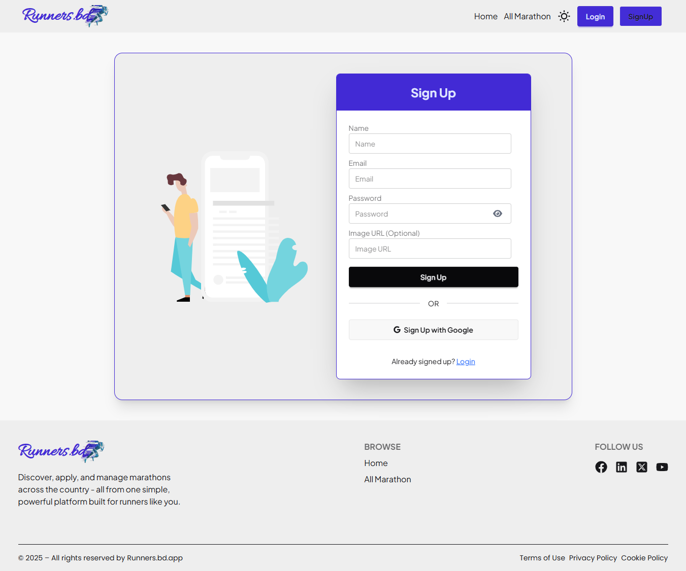
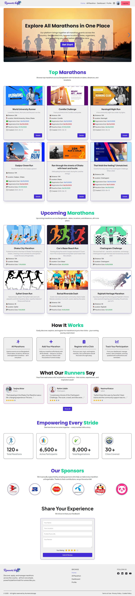
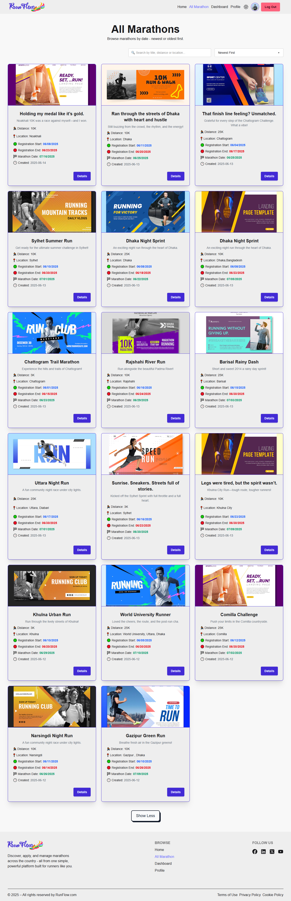
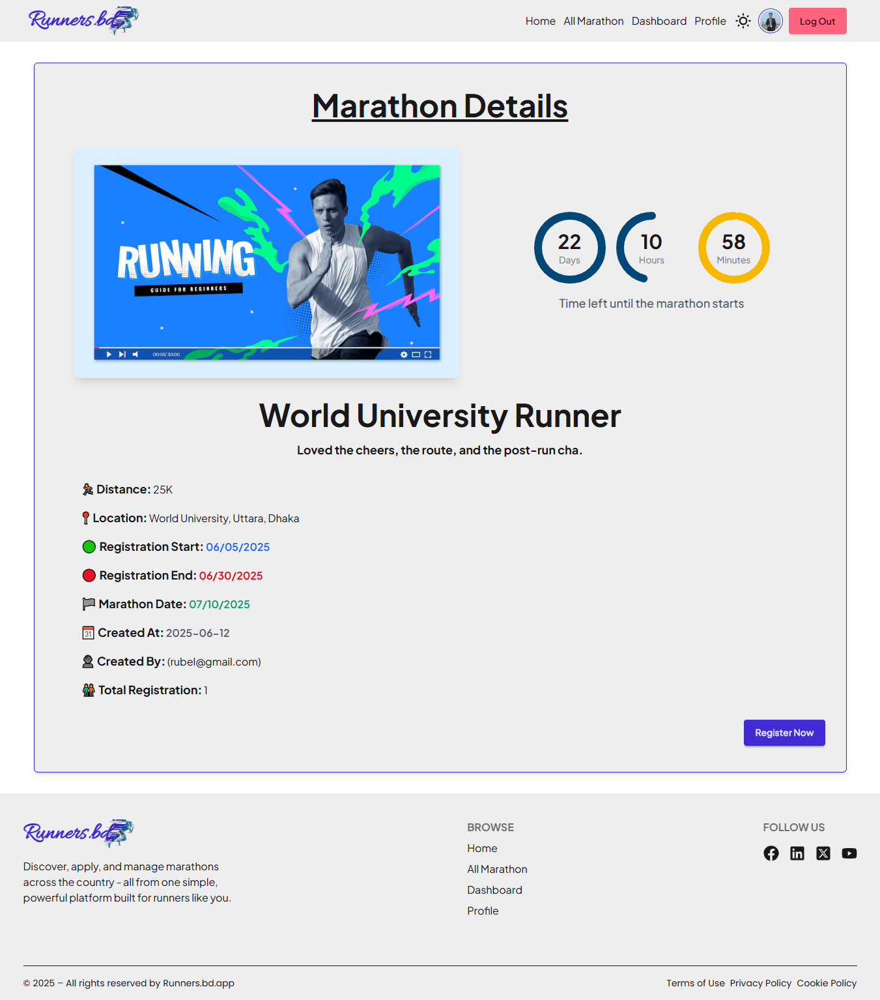
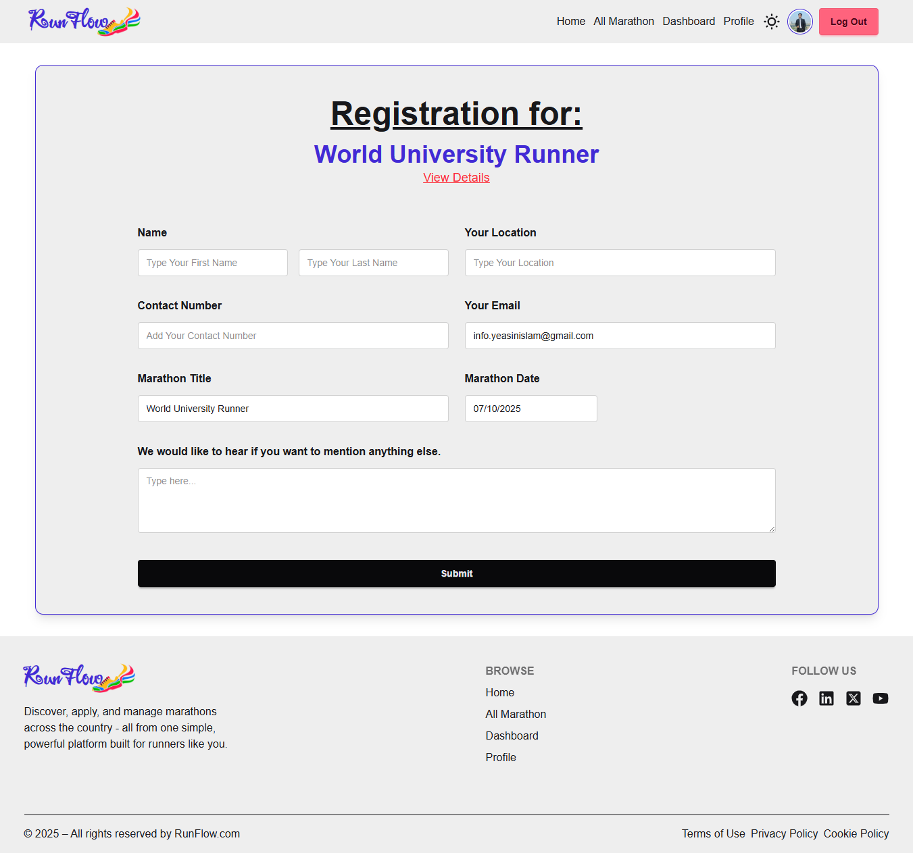
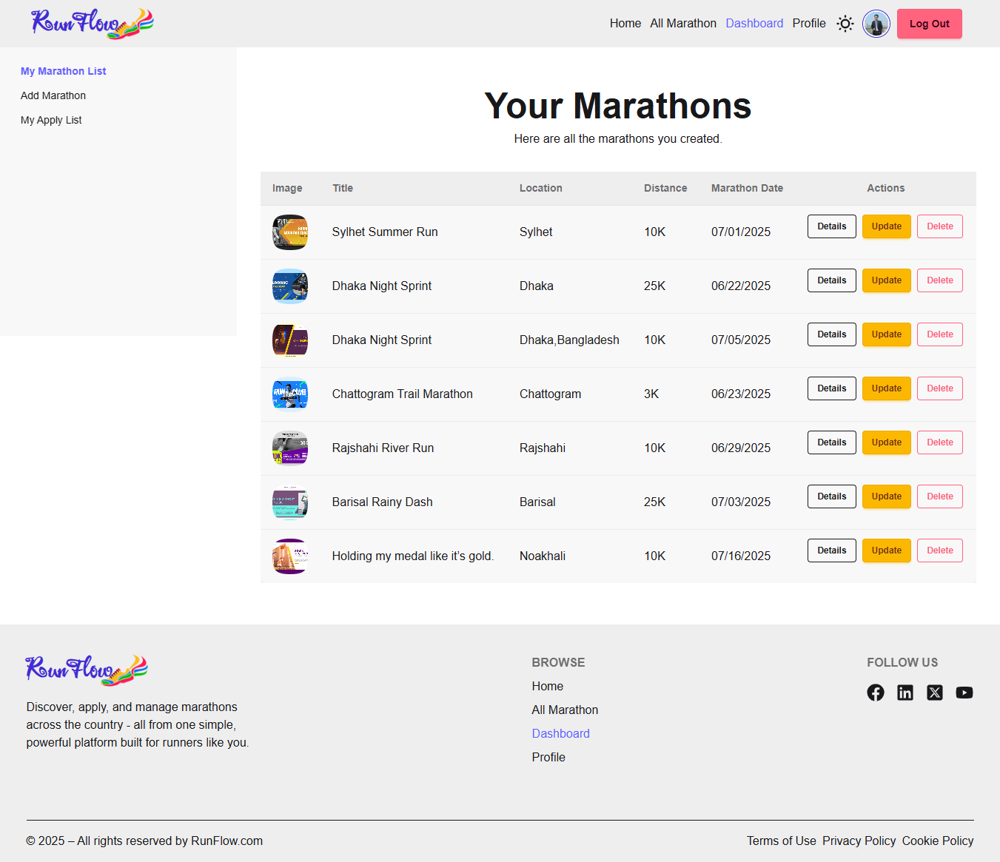
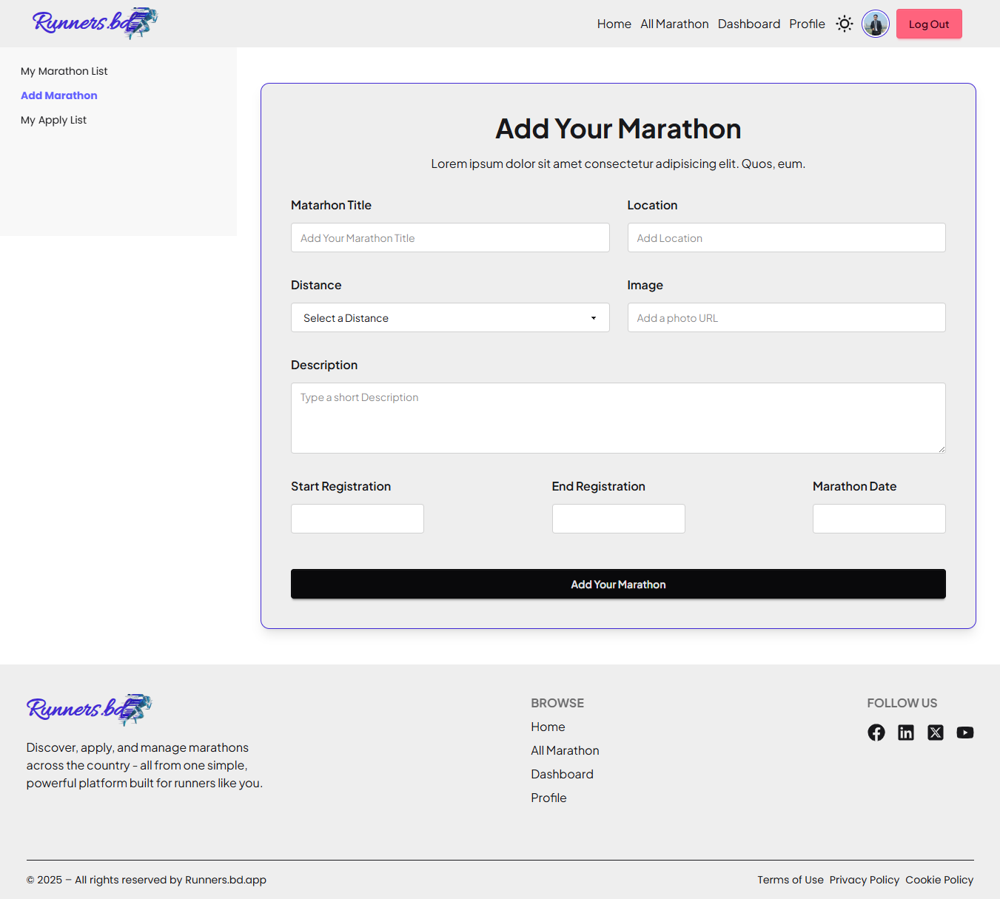
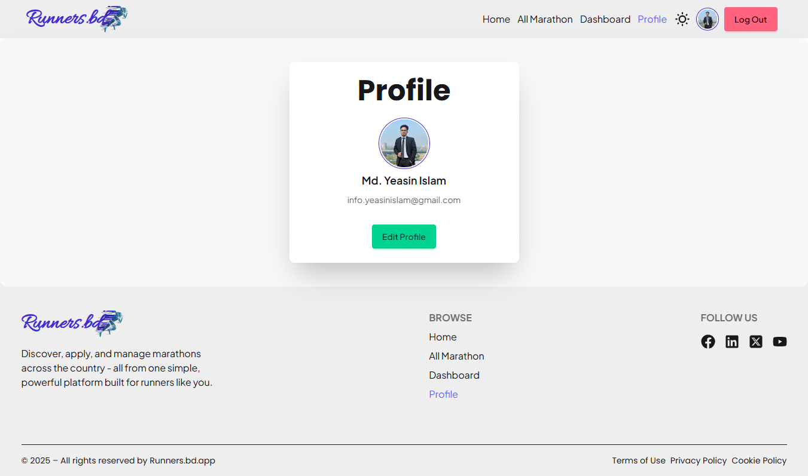

# Runners.bd 🏃
## Your Ultimate Marathon Management Platform

Welcome to **Runners.bd**, the go-to platform for organizing, exploring, and joining marathon events with ease and excitement.

---

## 🌍 Live Website

🔗 [Visit Runners.bd-Firebase](https://marathon-management-syst-f546e.web.app)
🔗 [Visit Runners.bd-Netlify](https://marathon-managment-system-catagori06.netlify.app)

---

## ✨ Features
- 🔍 **Explore Marathons**: View all upcoming races with rich filtering (by title, location, distance).
- 📝 **Apply to Events**: Runners can register for any marathon with a secure and easy process.
- ➕ **Add Marathons**: Organizers can add, update, or delete events directly from their dashboard.
- 🔐 **Role-Based Authentication**: Powered by Firebase Auth – supports runners and organizers with separate dashboards.
- ⏳ **Live Countdown Timers**: See real-time countdowns to the start of each marathon.
- ⭐ **Ratings & Reviews**: Share your feedback and read reviews from other participants.
- 📱 **Fully Responsive**: Built with Tailwind CSS + DaisyUI for a sleek experience on all devices.
- 📊 **Application Management**: View, update, and delete your applications with ease.
- 🔎 **Smart Search**: Quickly find your marathons or applications with built-in search bars.
- 🎨 **Dark/Light Mode Ready**: Future support for theming.

---

## ⚙️ Tech Stack

### Frontend:
- **React + Vite** – Fast modern SPA framework
- **Tailwind CSS + DaisyUI** – Utility-first styling and accessible UI components
- **React Router** – Dynamic routing with protected/private routes
- **React Hot Toast** – Elegant notifications for actions like update/delete

### Backend:
- **Node.js + Express** – RESTful API services
- **MongoDB** – NoSQL database for marathon and user data

### Authentication & Hosting:
- **Firebase Authentication** – Secure login & role management
- **Firebase Hosting** – Main deployment platform
- **Netlify** – Secondary hosting for fallback or testing

---

Happy running with **Runners.bd**! 🏁

---

## 📸 Website Preview

Here’s a quick look at **Runners.bd** in action:

---

### 🔐 Sign Up
  
**Create your account and join thousands of runners!**

---

### 🔑 Log In
  
**Access your dashboard and start your marathon journey.**

---

### 🏠 Home Page
  
**Explore top marathons, upcoming events, and smooth navigation.**

---

### 🗂️ All Marathons
  
**Browse all active and upcoming marathon listings.**

---

### 📄 Marathon Details
  
**Get full race info, registration details, and more.**

---

### 📝 Register for Marathon
  
**Easily sign up for your favorite marathons.**

---

### 📋 Dashboard – Your Marathons
  
**Organizers can manage and edit their listed marathons.**

---

### ➕ Dashboard – Add Marathon
  
**Post new marathon events with detailed info.**

---

### ✅ Dashboard – Registered Marathons
  
**Track all the marathons you've registered for.**

---

### 👤 Profile
  
**Manage your profile**

---
